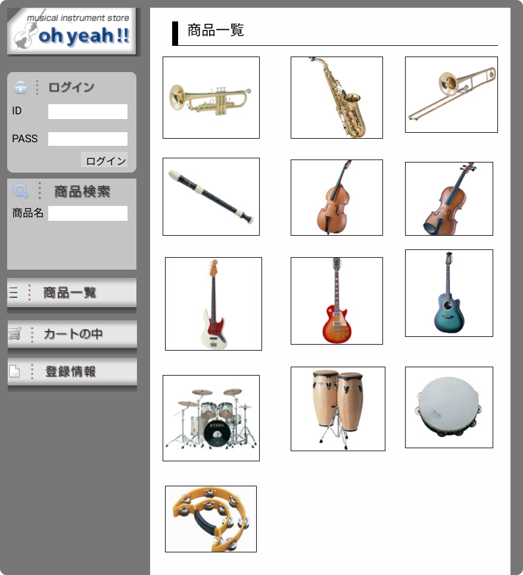

### 画面詳細図
## トップページ
### プロトタイプは以下のリンク先
[プロトタイプ](https://www.figma.com/file/ku60dzyRN9VaQCKVeAWSw4/Untitled?node-id=1%3A2)
*****

*****
補足：対応DBの列はDB設計後、丸を対応するテーブル・カラム名に差し替えること。
| ID | 要素 | 内容 | アクション | イベント | 対応DB |
|----|------|------|------------|---------|--------|
|1   |バナー|サイト名表示|-      |-        |-       |
|2   |ログイン|テキスト画像|-    | -        |-      |
|3|ID|入力欄|テキスト入力|-|-|
|4|PASS|入力欄|テキスト入力|-|-|
|5||||||
|6||||||
|7||||||
|8||||||
|9||||||
|10||||||
|11||||||
|12||||||
|13||||||
|14||||||
|15||||||
|16||||||
|17||||||
|18||||||
|19||||||
|20||||||
|21||||||
|22||||||
|23||||||
