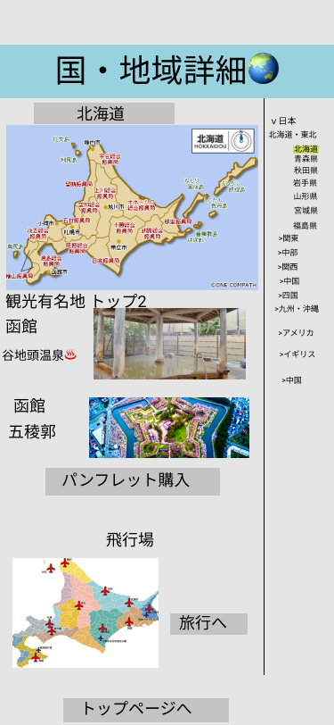

### 画面詳細図
## 国・地域詳細
### プロトタイプは以下のリンク先
[プロトタイプ](https://www.figma.com/file/ku60dzyRN9VaQCKVeAWSw4/Untitled?node-id=1%3A2)
*****

*****
補足：対応DBの列はDB設計後、丸を対応するテーブル・カラム名に差し替えること。
| ID | 要素 | 内容 | アクション | イベント | 対応DB |
|----|------|------|------------|---------|--------|
