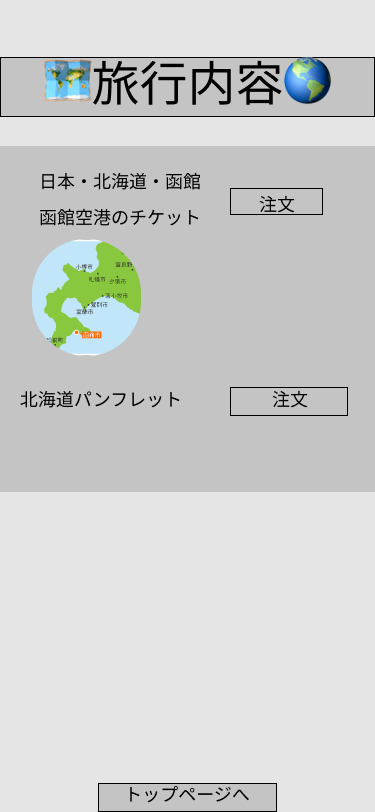

### 画面詳細図
## 旅行
### プロトタイプは以下のリンク先
[プロトタイプ](https://www.figma.com/file/YG5ey5pOtI5ZYlaZHWfvS7/Untitled?node-id=11%3A13)
*****

*****
補足：対応DBの列はDB設計後、丸を対応するテーブル・カラム名に差し替えること。
| ID | 要素 | 内容 | アクション | イベント | 対応DB |
|----|------|------|------------|---------|--------|
|1   |バナー|サイト名表示|-      |-        |-       |
|2   |国・地域名|国・地域名表示|-|-|〇
