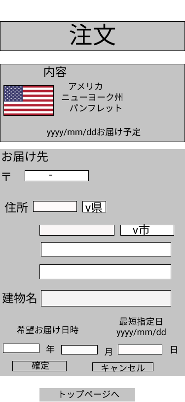

### 画面詳細図
## 注文
### プロトタイプは以下のリンク先
[プロトタイプ](https://www.figma.com/file/YG5ey5pOtI5ZYlaZHWfvS7/Untitled?node-id=18%3A18)
*****

*****
補足：対応DBの列はDB設計後、丸を対応するテーブル・カラム名に差し替えること。
| ID | 要素 | 内容 | アクション | イベント | 対応DB |
|----|------|------|------------|---------|--------|
|1   |バナー|サイト名表示|-      |-        |-       |
|2   |内容|注文を押された商品国・地域、商品名|-|-|〇|
|3   |国旗|注文を押された商品の国旗画像|-|-|〇|
|4   |お届け予定|届けられる予定日表示|Date|-|〇
|5   |郵便番号|入力欄|テキスト入力|-|〇|
|6|都道府県名|入力欄|テキスト入力|-|〇|
|7|都道府県選択|selectボックス|-|〇|
|8|市町村区名|入力欄|テキスト入力|-|〇|
|9|市町村区選択|selectボックス|-|〇|
|10|番地名|入力欄|テキスト入力|-|〇|
|11|建物名|入力欄|テキスト入力|-|〇|
|12|最短指定日|届けられる最短指定日表示|Date|-|〇
|13|年月日|入力欄|キスト入力|-|〇|
|14|確定ボタン|ボタン|注文確定処理実行|-|〇|
|15|キャンセルボタン|注文を無しに|-|-|〇|
