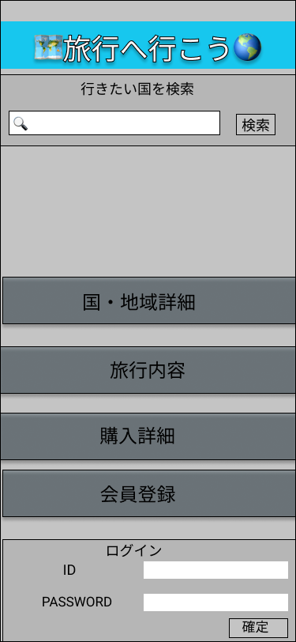

### 画面詳細図
## トップページ
### プロトタイプは以下のリンク先
[プロトタイプ](https://www.figma.com/file/YG5ey5pOtI5ZYlaZHWfvS7/Untitled?node-id=2%3A2)
*****

*****
補足：対応DBの列はDB設計後、丸を対応するテーブル・カラム名に差し替えること。
| ID | 要素 | 内容 | アクション | イベント | 対応DB |
|----|------|------|------------|---------|--------|
|1   |バナー|サイト名表示|-      |-        |-       |
|2   |ログイン|テキスト画像|-    | -        |-      |
|3   |ID|入力欄|テキスト入力|-   |〇        |        
|4   |PASS|入力欄|テキスト入力|-|〇                  |
|5   |ログインボタン|ボタン|クリック|ログイン処理実行|-|
|6   |地域検索|検索ボックス|テキスト入力|-|-|
|7|旅行内容|画像ボタン|クリック|旅行内容へ遷移|〇|
|8|購入詳細|画像ボタン|クリック|購入詳細へ遷移|〇|
|9|会員登録|画像ボタン|クリック|会員登録へ遷移|〇|
