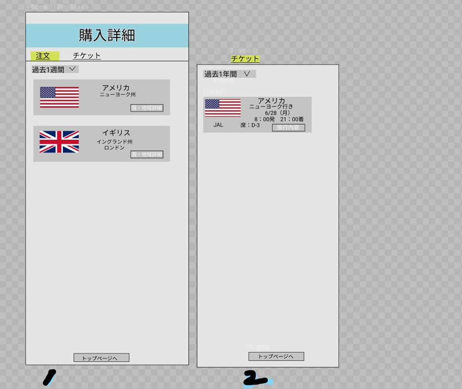

### 画面詳細図
## トップページ
### プロトタイプは以下のリンク先
[プロトタイプ](https://www.figma.com/file/YG5ey5pOtI5ZYlaZHWfvS7/Untitled?node-id=3%3A44)
*****

*****
補足：対応DBの列はDB設計後、丸を対応するテーブル・カラム名に差し替えること。
| ID | 要素 | 内容 | アクション | イベント | 対応DB |
|----|------|------|------------|---------|--------|
|1   |バナー|サイト名表示|-      |-        |-       |
|2   |ログイン|テキスト画像|-    | -        |-      |
|3   |表示1|パンフレットの注文履歴画面|表示|-|-|
|4   |表示2|チケットの注文履歴画面|表示|-|-|
|5   |注文タブ|1を表示|クリック|タブ移動|-|
|6   |チケットタブ|2を表示|クリック|タブ移動|-|
|7   |期間選択|選択された期間内の履歴を表示|selectボックス|-|-|
|8   |国名|国名表示|テキスト表示|-|-|-|〇|
|9   |地域名|地域名表示|テキスト表示|-|-|〇|
